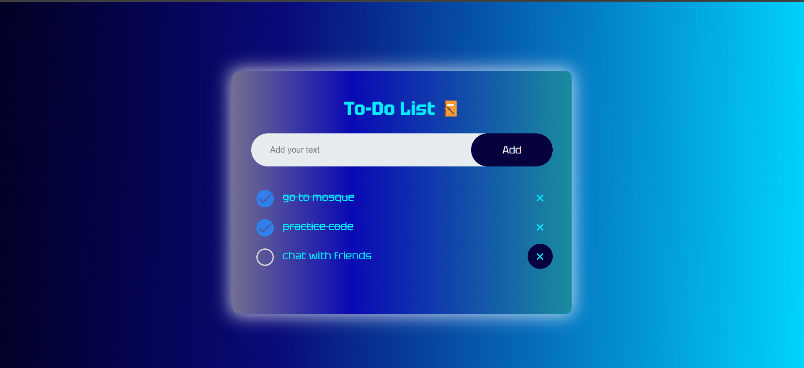
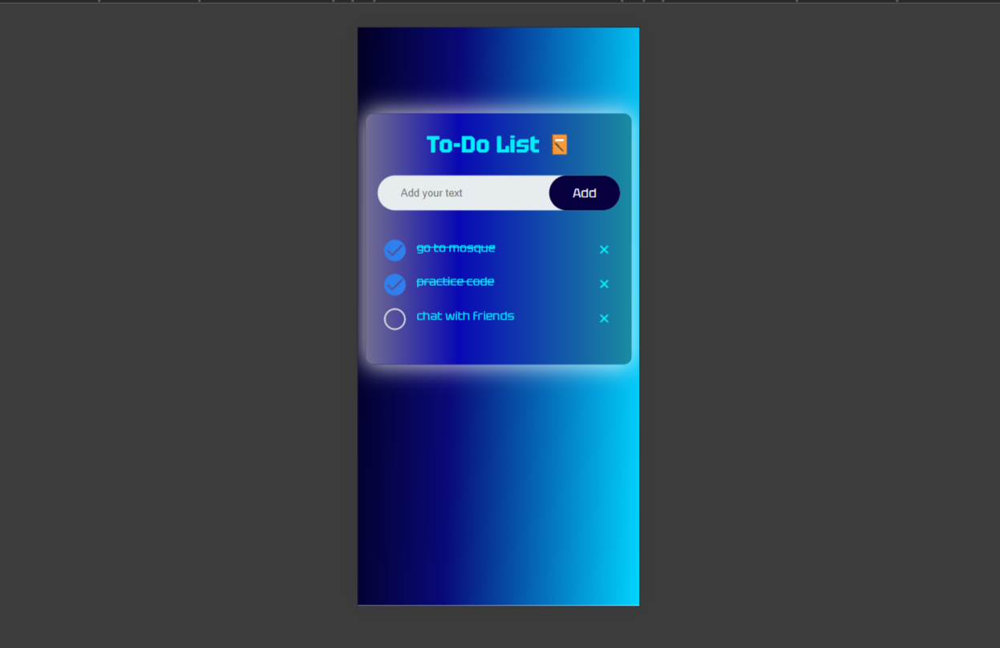

# Todo-List-Project
This the first mini project from the ASTU CPD web learning. It helped me to understand the bascis of html , css , javascript and DOM manipulation.

# How does it work?
 First the user writes the task that he want to put in the list on the input field. Then when the "Add" button is pressed the task that is written on the input field is added to the list. And after that the user can delete the task by pressing the "x" button, also the user can check or uncheck the tasks on the list.

# Final output

> ## Desktop or PC view

> ## Mobile view

 
